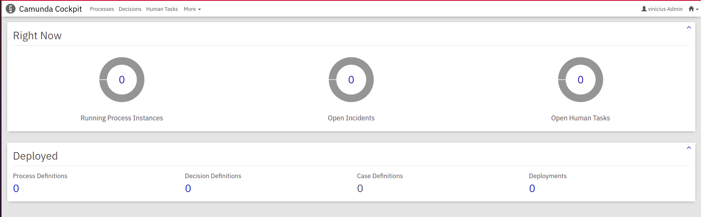

# External Task Camunda Spring Boot

## Objetivo

Projeto desenvolvido utilizando spring boot para desenvolver uma external task client que se comunica com a engine atráves de uma tarefa de serviço da modelagem, que ao ser chamada faz a integração com um microserviço REST do Via CEP.

## Tecnologias e Ferramentas Utilizadas

As seguintes ferramentas foram usadas na construção do projeto:

- [JDK 11](https://www.oracle.com/br/java/technologies/javase/jdk11-archive-downloads.html)
- [Intellij](https://www.jetbrains.com/pt-br/idea/)
- [Spring Boot](https://spring.io/projects/spring-boot)
- [Docker](https://www.docker.com/)
- [Maven](https://maven.apache.org/)
- [Camunda](https://docs.camunda.org/manual/7.16/)


## Pré requisitos

Ter instalado na sua máquina uma versão do Java, docker, docker-compose e o camunda modeler.

- Java Runtime Environment 1.8+
- Docker
- Docker Compose
- Camunda Modeler

## Como rodar a aplicação

1 - Execute os comandos abaixo no seu terminal para levantar a engine do cockipit, utilizando o docker.

```sh
docker pull camunda/camunda-bpm-platform:run-latest
docker run -d --name camunda -p 8080:8080 camunda/camunda-bpm-platform:run-latest
```

Após rodar os comandos, acima acesse a URL: http://localhost:8080 e informe o usuário e senha: demo, para acessar o cockipit, como na imagem abaixo:




2 - Abra o projeto na sua IDE de preferência e instale as dependências da aplicação e execute. A aplicação vai ser iniciada na porta 8081, pois a engine do cockpit estara rodando na porta 8080.

3 - Importe a collection do postman que está na pasta "src/main/resources/files" e faça o teste fazendo deployment do BPMN, iniciando um processo e completando uma tarefa.

4 - Caso queria ver modelagem está no diretório "src/main/resources/files"

## Modelagem do BPMN - Consulta CEP


